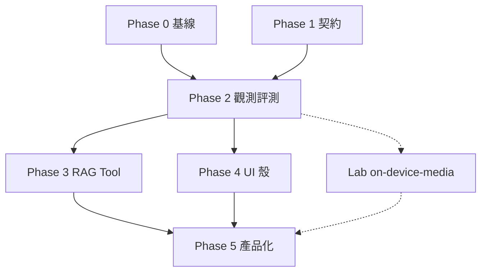

# ai-search-portal — 專案規劃（階段制）

> **生態 SSOT**：[platform-command/planning/projects/ai-search-portal.md](https://github.com/tessOu56/platform-command/blob/main/planning/projects/ai-search-portal.md)  
> **架構 SSOT**：[product-architecture-plan-2026-05.md](./architecture/ai-product/product-architecture-plan-2026-05.md)  
> **Agent 協作**：[agent-collaboration.md](./agent-collaboration.md)（skills／hooks／commands）  
> **收件**：[platform-inbox/CURRENT.md](./platform-inbox/CURRENT.md)

---

## 1. 定位

**個人產品實驗場**：穩定 **Agent 契約 + 可觀測 + 離線評測**；Catalog 類 UX 只做 **可演示最小殼**；WebGPU／WebCodecs／本機 LLM 僅在 **`labs/`**，通過階段門檻再 promote。

| 維度     | 本 repo                                      | Catalog（內部參考產品）      |
| -------- | -------------------------------------------- | ---------------------------- |
| 產品 UX  | mock-first、LUI、Items、`/catalog-search` 殼 | 搜尋／字典／申請／Agent 全線 |
| Agent    | `agent-core`、SSE、RAG、eval                 | 生產串流與錯誤治理           |
| 前沿媒體 | Lab `on-device-media`                        | 不複製；參考模式即可         |

**推進規則**：完成當前階段的「出口條件」再進下一階段；可並行僅限標示為 **平行軌** 的 Lab。

---

## 2. 現況（對照階段）

| 階段                | 狀態 | 備註                                        |
| ------------------- | ---- | ------------------------------------------- |
| Phase 0 基線        | 🔄   | Vercel、Langfuse UI 驗證、inbox tickets     |
| Phase 1 契約／管線  | ✅   | agent-core、stable SSE                      |
| Phase 2 觀測／評測  | 🔄   | eval CI ✅；Langfuse 手動 trace 待勾        |
| Phase 3 RAG／Tool   | ⬜   | Retriever 抽象、local 強化                  |
| Phase 4 UI 最小殼   | 🔄   | catalog-search ✅；api-detail、my-apis 待做 |
| Phase 5 產品化運維  | ⬜   | routing、quota、DLQ 等文件／spike           |
| Lab on-device-media | ⬜   | 平行軌；不阻塞 Phase 2–4                    |

---

## 3. 階段定義與出口條件

### Phase 0 — 基線（可部署、可協作）

**目標**：任何人（含 agent）能依文件跑起 repo，且中央 registry 可追蹤部署。

| 工作項     | 出口條件                                                                                            |
| ---------- | --------------------------------------------------------------------------------------------------- |
| CI         | `pnpm run build`、`test`、`lint:ci`、`test:labs` 全過                                               |
| 部署       | Vercel production URL 可開 → 寫入 platform-command `registry/projects.json`（T-2026-001）           |
| 煙測       | `/`、`/catalog-search`、chat health 有 runbook 勾選                                                 |
| Agent 協作 | `.cursor/skills/`、`.cursor/hooks.json` 就緒；見 [agent-collaboration.md](./agent-collaboration.md) |

---

### Phase 1 — 契約與 Agent 管線 ✅

**目標**：對外 chat 契約穩定，內部事件可映射。

| 已交付                               | 位置                                      |
| ------------------------------------ | ----------------------------------------- |
| Stable SSE、`mapInternalSseToStable` | `packages/shared-contracts`、`agent-core` |
| Guardrails v2、tool allowlist        | `packages/agent-core/src/tools/`          |
| agent-runtime 可選 HTTP              | `services/agent-runtime`                  |

**出口條件**：已滿足（維持不回歸即可）。

---

### Phase 2 — 可觀測與評測 🔄

**目標**：改 agent 必須能被 trace 與 golden eval 看見。

| 工作項       | 出口條件                                                     |
| ------------ | ------------------------------------------------------------ |
| Langfuse     | compose 後 **一筆** chat trace 在 UI 可見；runbook 記錄 env  |
| eval-runner  | CI 產出 `reports/eval-*.json`；`AGENT_RAG_MODE=local` 有案例 |
| 回歸（可選） | eval 失敗擋 PR（policy 寫入 CI 註解）                        |
| items.lookup | 真實打 Items API 路徑有 eval 覆蓋                            |

---

### Phase 3 — RAG 與 Tool 真實化

**目標**：RAG／tool 可切換實作，不破壞 Phase 1 契約。

| 工作項    | 出口條件                                          |
| --------- | ------------------------------------------------- |
| Local RAG | `local-store` 擴充 + eval 覆蓋                    |
| Retriever | `rag/retriever.ts`；env：stub / local / http      |
| 錯誤契約  | tool 失敗 → 穩定 SSE error（文件 + 測試）         |
| 文件      | `labs/rag-local` 記錄向量 DB 升級門檻（可不實作） |

---

### Phase 4 — 產品 UI（design-vibe 對齊）

**策略**：不複製 able 全量；只做 GAP 表內可演示殼。

| Flow           | 優先 | 出口條件                                                                      |
| -------------- | ---- | ----------------------------------------------------------------------------- |
| catalog-search | P0   | GAP 列 Figma node **或** waiver；Panel 對齊 toolbar／pagination（T-2026-004） |
| api-detail     | P0   | 三欄 layout 占位 + 路由；GAP 列更新                                           |
| my-apis        | P1   | `/my-apis` 卡片列表 + mock                                                    |
| requests       | P2   | 規格 only，不實作                                                             |

對照：[labs/design-vibe/GAP-REPORT.md](../labs/design-vibe/GAP-REPORT.md)。

---

### Phase 5 — 產品化運維

**目標**：為長期流量與成本做設計 spike，不強制一次實作。

| 主題                        | 產出                                                                                      |
| --------------------------- | ----------------------------------------------------------------------------------------- |
| Model routing、quota、cache | [productization-roadmap.md](./architecture/ai-product/productization-roadmap.md) 細化 ADR |
| DLQ、retry、idempotency     | spike 文件 + 與 Gateway 邊界對齊                                                          |
| 成本／延遲 dashboard        | 資料源清單（Langfuse + logs）                                                             |

---

### 平行軌 — Lab `on-device-media`

**目標**：瀏覽器內 WebCodecs → WebGPU POC；**不**改 chat 契約。

| 子階段 | 內容                               | 出口條件             |
| ------ | ---------------------------------- | -------------------- |
| ODM-1  | WebCodecs → `VideoFrame`（Worker） | 可重現 demo + README |
| ODM-2  | WebGPU 單 pass WGSL                | 短 clip 穩定預覽     |
| ODM-3  | 可選 WASM／記憶體筆記              | 文件一節             |
| ODM-4  | 可選與 RAG stub 接軌               | 1 eval case          |

**Promote 規則**：僅當 Phase 4 有明確產品需求且效能／bundle 評估通過，才進 `app/`。

---

## 4. 階段依賴（建議順序）



Phase 1 已完成；**當前焦點**：Phase 0 收尾 + Phase 2 閉環 + Phase 4 catalog-search／api-detail。

---

## 5. 滾動待辦（依階段，非日曆）

**Phase 0**

- [ ] T-2026-001 Vercel + registry URL
- [ ] Agent AC-1：依 [agent-collaboration.md](./agent-collaboration.md) 驗證 session + pr-gate 一輪

**Phase 2**

- [ ] Langfuse UI 一筆 trace
- [ ] CI green（含 `test:labs`）

**Phase 4**

- [x] catalog-search `?type=` + pagination（mock）
- [ ] T-2026-004 CatalogSearchPanel GAP
- [ ] api-detail GAP 占位文件

**Backlog（非 sprint；T-2026-092 draft P2）**

- [ ] CI／ritual：`check:metalcraft-knowledge`（commerce drift）
- [ ] Node 22：`e2e/catalog-commerce.spec.ts` 綠或 waiver
- [ ] `/api/knowledge/search` OpenAPI 升格 **或** 維持 Zod-only（已註記）
- [ ] Metadata commerce chips（僅 UX 需要時）

---

## 6. 停步與不做

| 停步     | 說明                                            |
| -------- | ----------------------------------------------- |
| STOP-001 | Vercel → [STOP-EXTERNAL.md](./STOP-EXTERNAL.md) |
| STOP-003 | Figma MCP → GAP waiver                          |

**不做**：複製 able 五主線、Azure 部署、全站 i18n、在 `app/` 直接掛 WebGPU／本機 LLM。

---

## 7. 品質閘（不變）

```bash
pnpm run build && pnpm run test && pnpm run lint:ci
pnpm run test:labs && pnpm run eval:offline
pnpm run observability:up && pnpm run observability:smoke
```

---

## 8. 相關 repo

| Repo                      | 關係                               |
| ------------------------- | ---------------------------------- |
| platform-command          | registry、tickets、agent 生態 SSOT |
| 內部 catalog 鏡像（私有） | Catalog 參考（唯讀）               |
| develop-md                | 長文、願景                         |
| polyglot-labs             | 後端模式實驗                       |

---

_階段出口條件變更時，同步更新本檔與 platform-command `planning/projects/ai-search-portal.md`。_
