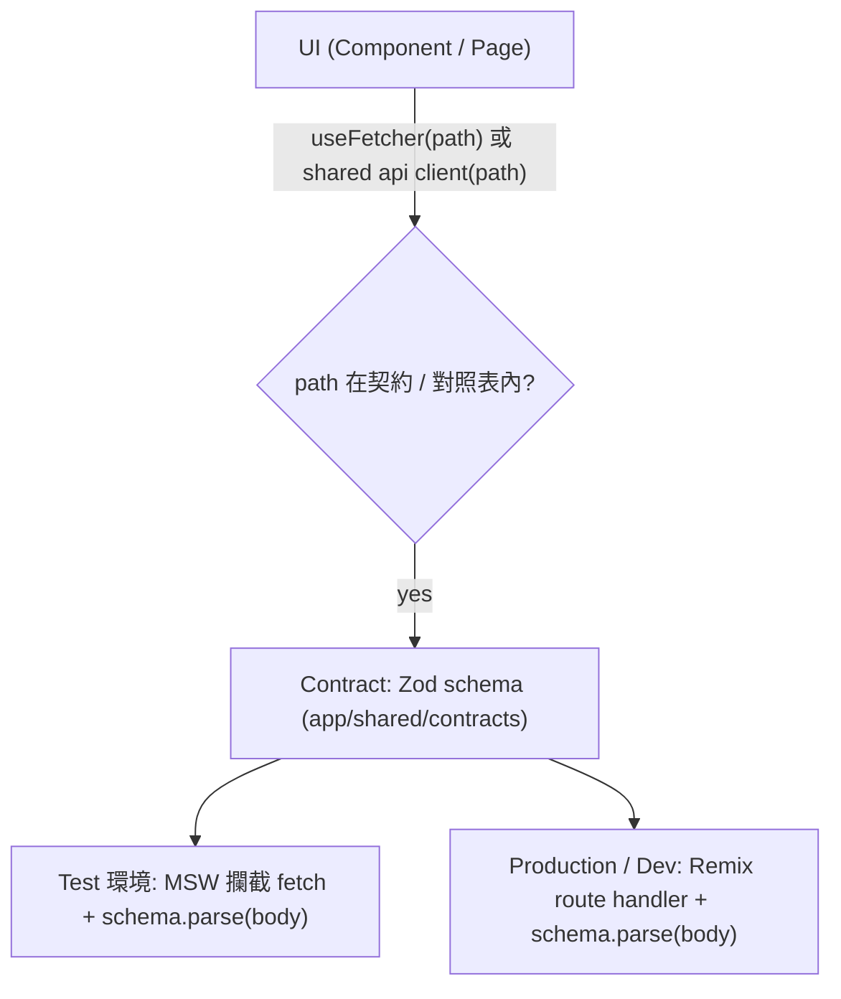

# 資料流與 Data-Driven 架構

**類型**：reference | **權重**：2

本文件描述「資料測試導向」下的請求與契約流動方式。

---

## 資料流（請求方向）

> 禁止在 component 內直接 `fetch(任意 URL)`；一律走 `useFetcher(path)` 或 `app/shared/api`（契約路徑）。

---

## 角色對應

| 角色           | 職責                                          |
| -------------- | --------------------------------------------- |
| **Spec**       | 業務範圍、資料流、驗收；docs/product / ticket |
| **Contract**   | Zod schema；request/response 可驗證           |
| **Mock (MSW)** | Handler 產出經 schema parse；可執行規格       |
| **Test**       | 依 handler 與 fixture；可先於 UI              |
| **UI**         | 只打契約路徑；不直接 fetch 硬編碼             |

---

## 相關

- [data-test-driven](../conventions/data-test-driven.md)：完整流程與強制規則
- [contract-schema](../../specs/api/contract-schema.md)：Zod 使用與 template
- [handler-mapping](../../specs/api/handler-mapping.md)：path 與 handler 對應
