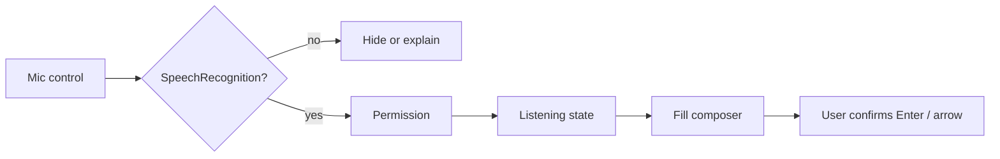

# Portal a11y + voice input plan

**Surface:** product (chat) + marketing (home composer)  
**Status:** Phase 2 shipped (live region + Web Speech composer); TTS still follow-up
**Ticket:** T-2026-078

## Goals

1. Make LUI chat usable with keyboard and screen readers when the transcript has data.
2. Add voice input as a progressive enhancement next to the ask/composer panel — never block text.

## Chat accessibility (when conversation has data)

| Item              | Approach                                                                                                                         |
| ----------------- | -------------------------------------------------------------------------------------------------------------------------------- |
| Skip link         | Keep / add `a11y.skipToContent` → `#home-chat` or `main`                                                                         |
| Transcript        | `role="log"` + polite live region for assistant updates (not every token flood; prefer chunk / final, or trailing-window polite) |
| Errors            | `role="alert"` / existing Alert (assertive)                                                                                      |
| Focus             | After reply completes, optional focus move to summary or keep composer; document choice in PR                                    |
| Composer          | Visible/accessible labels; icon-only arrow submit needs `aria-label` (i18n `chat.submit`)                                        |
| Decorative chrome | StarCursor / atmosphere `aria-hidden`; respect `prefers-reduced-motion`                                                          |
| Testing           | jsx-a11y in CI; axe DevTools smoke on home + chat with ≥1 turn                                                                   |

## Voice input (Web Speech)

- API: `SpeechRecognition` / `webkitSpeechRecognition` (browser).
- Locale: map portal `locale` → `recognition.lang` (`zh-TW`, `en-US`).
- States (i18n keys `composer.voice.*`): idle · listening · unsupported · denied · error.
- Phase 1: document + ticket.
- Phase 2 (shipped): recognition wired into shared `Composer` (`HomeAskPanel` / conversation); unsupported browsers hide the mic; permission/error copy does not block typing; user confirms with Send.
- Privacy: browser may send audio to vendor cloud ASR — disclose in help / settings copy.
- Out of Phase 2: TTS of assistant replies (Phase 3).

## Acceptance (T-2026-078)

- [x] Live region announces waiting while streaming, then summary/body — not every token
- [x] Arrow / mic controls have accessible names
- [x] Unsupported browsers still allow full text ask path (mic hidden)
- [x] Docs + CAPABILITIES.md stay in sync

## Related

- [`docs/CAPABILITIES.md`](../CAPABILITIES.md)
- Shared composer: `Composer` (landing typewriter + conversation bottom bar; arrow submit)
