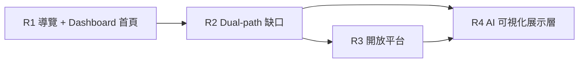
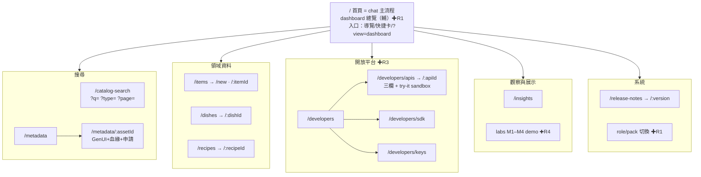
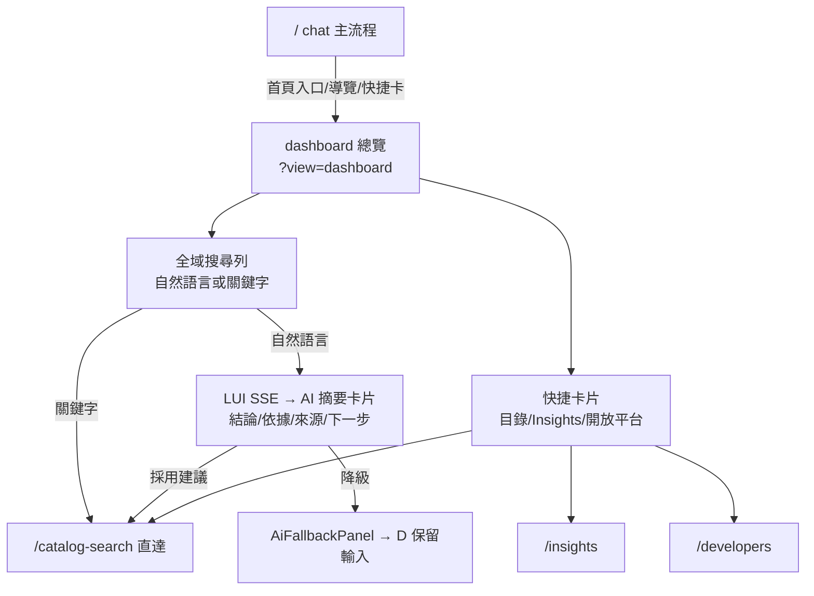
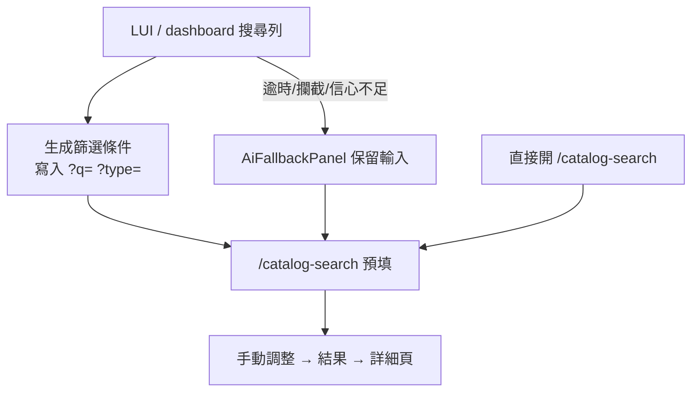
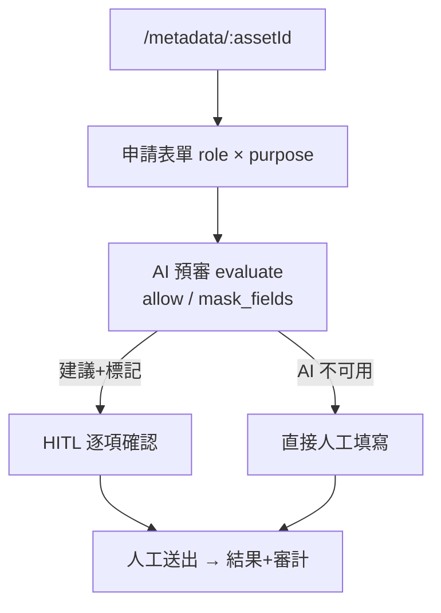
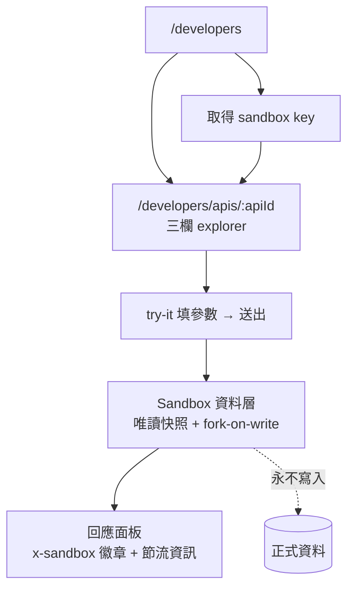

# 介面端產品 Roadmap × Sitemap × UI Flow

> **As-is sitemap（歷史規劃稿）。** 階段／票／「哪些畫面算 LIVE」的 SSOT 在 private **platform-command**：`planning/projects/surface-completeness.md`。本檔不要再當階段出口條件；dual-path 原則仍見 [ai-experience-plan.md](./ai-experience-plan.md)。
>
> 建立日：2026-07-08（v2）· 上游原則：dual-path（每條 AI 流程都有手動路徑）
> v2 決策：① Chat 為預設首頁與主流程；Dashboard 為 **AI 儀錶板搜尋總覽（輔助路徑）**，經首頁入口／頂部導覽／快捷卡片／`?view=dashboard` 進入 ② 以**開放平台（API / SDK / Sandbox）**取代原 Phase 4 的外部參考頁面規劃 ③ 業務體系完全自足，不引用任何外部產品術語

---

## 0. 邊界備註（公開敘述）

本產品業務體系**完全自足**（§1）。可參考一般「問題–解法」與架構模式，但：

| 規則      | 說明                                                     |
| --------- | -------------------------------------------------------- |
| 業務隔離  | 不把任何外部／雇主產品術語、流程、資料寫進本產品業務定義 |
| 資安      | 不複製外部產品程式碼、設定、或資料到本 repo              |
| 公開 repo | 遵循 [PUBLIC-NARRATIVE.md](../PUBLIC-NARRATIVE.md)       |

---

## 1. 產品業務體系（自足定義）

本產品是 **AI 搜尋與資料目錄平台**（food/recipe 為示範領域資料集），四條產品線：

| 產品線       | 內容                                                                                            | 介面入口                                                        |
| ------------ | ----------------------------------------------------------------------------------------------- | --------------------------------------------------------------- |
| AI 搜尋體驗  | **主流程**：LUI 對話搜尋（提出問題、搜尋資料、理解資料、取得建議）；**輔助**：AI 儀錶板搜尋總覽 | `/`（chat 預設）· dashboard 經首頁入口／導覽／`?view=dashboard` |
| 資料目錄     | 目錄搜尋、metadata 資產、血緣、存取申請                                                         | `/catalog-search`、`/metadata`                                  |
| 領域資料集   | 產品自有內容（dishes / recipes / items 維護）                                                   | `/dishes`、`/recipes`、`/items`                                 |
| **開放平台** | 對外提供產品 API / SDK 測試呼叫，**不影響系統資料**                                             | `/developers`（R3 新建）                                        |

### 開放平台安全原則（Sandbox 隔離）

對外可測試呼叫，但正式資料零風險：

| 規則           | 說明                                                                                                     |
| -------------- | -------------------------------------------------------------------------------------------------------- |
| Sandbox 資料層 | try-it 呼叫一律走 **session 級 ephemeral store**（正式資料唯讀快照 + fork-on-write），session 結束即銷毀 |
| 寫入隔離       | POST/PUT/DELETE 只作用於 fork，永不落正式庫；回應標示 `x-sandbox: true`                                  |
| 憑證分層       | sandbox API key（demo 發放）≠ 正式憑證；key 只授權 sandbox scope                                         |
| 節流           | sandbox rate limit + 單 session 資料量上限                                                               |
| 可稽核         | 呼叫紀錄入 sandbox 專屬 log，不混入正式審計                                                              |

---

## 2. 介面端 Roadmap（R1–R4）

### R1 — 導覽與資訊架構 + Dashboard 首頁

| 工作項                               | 內容                                                                                                                                                                                 | 對應                             |
| ------------------------------------ | ------------------------------------------------------------------------------------------------------------------------------------------------------------------------------------ | -------------------------------- |
| 全站 sidebar/nav                     | 實作 `app/features/layout/sidebar/`（現為空 scaffold），root layout 掛載；分群見 §3                                                                                                  | 新                               |
| **Dashboard 儀錶板總覽（輔助路徑）** | `?view=dashboard`：AI 儀錶板搜尋總覽——掌握資料狀態、摘要結果、常用入口與產品線概況；**不取代 chat 主流程**；取代現有 `?view=saas` demo。入口：首頁入口、頂部導覽、快捷卡片、URL 參數 | 新（本次決策）                   |
| 首頁主題                             | 暖色盤 token map（見 §5），經 explore-design-sdk 供裝，不 hardcode；chat 與 dashboard 共用同一設計語言，資訊層級 chat 主、dashboard 輔                                               | DESIGN_SYSTEM                    |
| Insights 入口                        | sidebar + dashboard 快捷卡加 `/insights` 連結                                                                                                                                        | DATA-VIZ-PLAN 待辦               |
| Role/pack 狀態列                     | 導覽列顯示目前 role 與 context pack，可切換                                                                                                                                          | ai-experience-plan 缺 UI 標示 ⬜ |
| 麵包屑                               | 詳細頁統一 breadcrumb                                                                                                                                                                | 新                               |

**出口條件**：`/` 預設進 chat 工作頁；dashboard 總覽可經四種入口進入且為儀錶板搜尋版面；任一頁面可經導覽到達其他所有頁面；role/pack 狀態全站可見。

### R2 — Dual-path 缺口補齊（ai-experience-plan 缺口優先序）

| 優先 | 工作項            | 內容                                                                                                                                              |
| ---- | ----------------- | ------------------------------------------------------------------------------------------------------------------------------------------------- |
| ①    | AI→手動預填       | ✅（2026-07-09）chat 失敗 → 寫入 URL（`?q=`+`?type=`）→ `/catalog-search` 接手；URL 契約 SSOT：`app/features/catalogsearch/catalog-search-url.ts` |
| ②    | AI 代填視覺標記   | items/申請表單 AI 代填欄位加標記，逐項確認/改寫                                                                                                   |
| ③    | `AiFallbackPanel` | ✅ 首發（2026-07-09）`app/components/shared/chat/AiFallbackPanel.tsx`：失敗/斷線 → 保留輸入＋預填連結；逾時/信心不足觸發擴充待 T-2026-020         |
| ④    | Metadata 申請畫面 | `/metadata/$assetId` 申請表單完整化（AI 預審 `evaluate` 已有）（T-2026-023）                                                                      |

**出口條件**：六條流程「AI 路徑 ↔ 手動路徑」雙向可走；E2E 雙軌（M6 覆蓋權限申請手動路徑）。

### R3 — 開放平台（Developer Hub）

取代原 Phase 4 外部參考頁面規劃，改為自有產品的對外開發者體驗：

| 優先 | 頁面                                           | 內容                                                                                                                            |
| ---- | ---------------------------------------------- | ------------------------------------------------------------------------------------------------------------------------------- |
| P0   | `/developers`                                  | 開放平台首頁：產品 API 總覽、SDK 快速開始、sandbox key 取得                                                                     |
| P0   | `/developers/apis` + `/developers/apis/$apiId` | API reference explorer：三欄（endpoint 清單 / 說明與 schema / **try-it 面板**）；資料源 = `specs/openapi/openapi.yaml` 單一事實 |
| P0   | Try-it sandbox                                 | try-it 呼叫走 §1 sandbox 資料層；回應面板標示 sandbox 徽章                                                                      |
| P1   | `/developers/sdk`                              | SDK 快速開始（TS client 由 openapi-typescript 生成）+ 範例程式碼                                                                |
| P2   | `/developers/keys`                             | sandbox key 管理（demo 級，session 內有效）                                                                                     |
| —    | catalog-search 完成度                          | 篩選 + 分頁 + 虛擬列表（10k mock benchmark）                                                                                    |

**出口條件**：外部使用者可從 `/developers` 完成「看文件 → 拿 sandbox key → try-it 呼叫 → 看回應」全程，且正式資料零寫入（E2E 驗證 fork 隔離）；M5 benchmark 數字入 ledger。

### R4 — AI 可視化展示層（M1–M4，走 `labs/` promote）

| 里程碑             | 介面產出                                                                                    |
| ------------------ | ------------------------------------------------------------------------------------------- |
| M1 推理可視化      | chat/dashboard 串流面板顯示 reasoning / tool-call 事件（帶 latency）、partial JSON 漸進渲染 |
| M2 Guardrails 面板 | 輸入/工具/輸出三層即時可視化 + OWASP 標籤                                                   |
| M3 可解釋 RAG      | dense vs hybrid 並排召回、引用來源、誠實拒答                                                |
| M4 GenUI（防禦性） | tool 結構化資料 → 元件渲染 + Zod 驗證 + HITL 批准卡片                                       |

**出口條件**：各 demo 可從導覽進入、不破壞 v1 stable SSE 契約。

### 延後 / 不做（介面端）

| 項目                      | 決策                                   |
| ------------------------- | -------------------------------------- |
| 真實登入/auth             | 不做；維持 role 模擬（R1 role 切換器） |
| Admin 後台                | 不做                                   |
| sandbox 正式計費/配額系統 | 不做；demo 級 key + 節流即可           |

---

## 3. Sitemap（目標態）

導覽分群（R1 sidebar）：**搜尋**、**領域資料**、**開放平台**、**觀察與展示**、**系統**。API/resource 路由（`api.*` 等）不入導覽。

---

## 4. UI Flow

### 4.1 AI 儀錶板搜尋總覽（R1 輔助路徑）

### 4.2 目錄搜尋 dual-path（缺口①③）

### 4.3 Metadata 存取申請（缺口④）

### 4.4 開放平台 try-it（R3）

共同規則（ai-experience-plan §1）：AI 中間狀態寫 URL/store，手動畫面可接手；降級不清空輸入；代填欄位可稽核。

---

## 5. 首頁主題（設計 token）

首頁（chat 與 dashboard 共用同一設計語言）採暖色盤，經 explore-design-sdk token map 供裝，portal 不 hardcode 色值。資訊層級以 chat 為主、dashboard 為輔。

**2026-07-08 更新（PALETTE v5）**：預設主題改為**若草 Wakakusa**（`portal-wakakusa(.dark)` map），配合「細緻手寫感 × 圖文拼貼」art direction；蜜蝋降為 ThemeSwitcher 切換選項。色值 SSOT 見 SDK `docs/PALETTE.md` §5（不在此重複）：

| Token 角色         | 值（若草 light）                                                  | 用途                                                              |
| ------------------ | ----------------------------------------------------------------- | ----------------------------------------------------------------- |
| text               | `#0F0906`                                                         | 主文字                                                            |
| background         | `#FEFCFB`                                                         | 底色（暖紙白）                                                    |
| primary            | `#BD8356`                                                         | 主行動、搜尋列 focus、重點卡片（陶土焦糖）                        |
| secondary          | `#B8D798`                                                         | 卡片底、分隔區塊（嫩葉綠）                                        |
| accent             | `#8ACD7E`                                                         | 徽章、圖表強調、hover（鮮綠）                                     |
| 字體（和紙編輯風） | Petrona / Shippori Mincho（display）+ Inter（內文；Tajawal 待評） | SDK `font.display` / `font.body`，含系統字 fallback               |
| 字距／行高         | display 寬字距 0.05em、body 0.01em、行高 1.75                     | SDK `type.*.tracking` / `type.*.leading`（2026-07-08 已入 token） |

參考：[Realtime Colors 配置](https://www.realtimecolors.com/?colors=0f0906-fefcfb-bd8356-b8d798-8acd7e&fonts=Petrona-Tajawal)。chat 與 dashboard 共用此設計語言；view 切換僅換版面結構與資訊層級，不換主題。

---

## 6. 對齊與同步

- 缺口狀態變更 → 同步 [ai-experience-plan.md](./ai-experience-plan.md) §2 對照表。
- 開放平台落地 → `specs/openapi/openapi.yaml` 為 API reference 單一事實；SDK 生成流程入 docs。
- 進度回報 → platform-command `planning/projects/ai-search-portal.md`。
