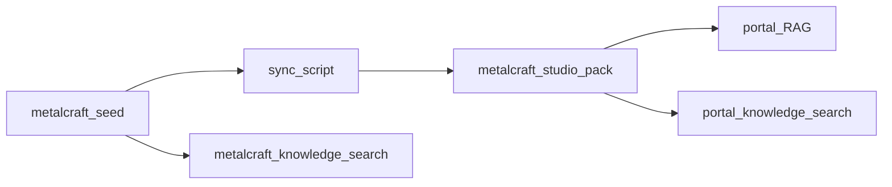

# Metalcraft knowledge layer（雙入口 + 業界分面）

## Purpose

金工領域知識以 **三層 chunk + 業界分面** 表達，供：

1. **ai-search-portal** — LUI / pack-aware local RAG + `/api/knowledge/search`
2. **metalcraft-platform (Plinth)** — seed 投影的 knowledge search（同 schema）

**不合併 repo。** Portal 的 `content/context-packs/metalcraft-studio/` 是消費端 SSOT；metalcraft seed 是來源端。

## Chunk shape

```ts
{
  id, kind: "glossary" | "narrative" | "ops",
  title, text, tags[], refs[],
  facets: {
    materials[], techniques[], regions[],
    classification, locale, standards[],
    productTypes[], auctionEligible
  }
}
```

契約：`@ai-search-portal/contracts` → `knowledge.contract.ts`  
Metalcraft 鏡像：`@metalcraft/contracts` → `knowledge.ts`

## Industry facets（對齊工作室／畫廊目錄慣例）

| Facet             | 例                                                                            |
| ----------------- | ----------------------------------------------------------------------------- |
| `materials`       | sterling_silver, fine_silver, gold, copper, bronze…                           |
| `techniques`      | forging, annealing, lost_wax, patination, stone_setting…                      |
| `regions`         | TPE, NTP（Plinth regionCode）                                                 |
| `classification`  | material, technique, auction, studio_ops, provenance…                         |
| `standards`       | 925, 999, 14K, 18K, 22K, 950…（印記／成色／K 金）                             |
| `productTypes`    | experience, physical, material, tool, venue_rental（對齊 Plinth ProductType） |
| `auctionEligible` | boolean — 孤品／限時拍賣可投標                                                |

## Industry code registry

Canonical table（別名可查）：`packages/shared-contracts/src/industry-codes.ts`  
Pack 鏡像：`content/context-packs/metalcraft-studio/industry-codes.json`  
Metalcraft 鏡像：`@metalcraft/contracts` → `industry-codes.ts`

Query `standard=Ag925` / `Au750` 會正規化為 `925` / `18K`。

## Search API

```
GET /api/knowledge/search?q=&pack=&kind=&material=&technique=&region=&classification=&standard=&productType=&auctionEligible=&limit=
```

Response 含 `data` + `facets`（含 `standards` / `productTypes` / `auctionEligible` 彙總）。

`auctionEligible` query：僅 `true`/`1` 啟用過濾；`false`/`0` 視為未設（不反向過濾）。

## UI wiring（partial）

| Surface                       | 行為                                                                                    |
| ----------------------------- | --------------------------------------------------------------------------------------- |
| Portal `/catalog-search`      | Domain knowledge 區與 Assets 分列；industry + commerce chips + 深鏈                     |
| Portal `/metadata`            | industry chips + knowledge bridge（可點進 entity／catalog）；commerce params 保留於 URL |
| Portal chat LUI               | RAG 依印記／材質／commerce 加權；sources 深鏈 + Continue CTA（含 productType／auction） |
| Portal chat `AiFallbackPanel` | 從 query 推斷分面；925 / 18K / 950 + Experience / Physical / Auction 快捷 CTA           |
| Plinth `/discover`            | 關鍵字搜尋 + material/standard/productType/auction chips；空結果推薦                    |

## Deep-link rules

1. `refs` 含 `dim-`／`tbl-`／`metric-` → `/metadata/:id?pack=`
2. 否則有 `standards`／`materials` → `/catalog-search?standard=&material=`
3. Plinth：`prod-*` → `/works/:id`；`studio-*` → `/studios/:slug`

## Non-success paths

| Case                                                                       | Behavior                                          |
| -------------------------------------------------------------------------- | ------------------------------------------------- |
| Invalid `material` / `standard` / `productType` / `auctionEligible` on API | **400**（Portal route + MSW 對齊）                |
| Invalid facets on catalog/metadata/Discover URL                            | strip + `facetWarning`；不半過濾                  |
| Empty results                                                              | 文案 + Clear industry filters（保留 q／intent）   |
| Metadata All chips                                                         | loader **只信 URL**（推斷僅 AiFallback 寫入連結） |
| Discover `region`                                                          | `regions: []` 視為全域（glossary 不過濾掉）       |
| Bad `pack`                                                                 | **400** Invalid pack id                           |

## Pack files（metalcraft-studio）

| File                            | Kind      | Role                                        |
| ------------------------------- | --------- | ------------------------------------------- |
| `glossary.json`                 | glossary  | 術語 + facets（含印記、失蠟、發色…）        |
| `narrative.json`                | narrative | Studio / Designer / Product 敘事 + facets   |
| `ops.json`                      | ops       | 訂單／拍賣／成色入庫 stub                   |
| `industry-codes.json`           | —         | 印記／K 金代碼表（對齊 contracts registry） |
| `assets.json` / `bindings.json` | —         | metadata catalog + entity 對齊              |

## Sync

```bash
pnpm run sync:metalcraft-knowledge
pnpm run check:metalcraft-knowledge   # CHECK_ONLY：coverage + commerce drift vs seed-snapshot
```

Idempotent：seed studios/designers/products → `narrative.json`（含 `productTypes` / `auctionEligible`）。結束時印出 **coverage report**（missing seed 對應、無 productTypes、無 auctionEligible bool、sterling 缺 standards、**commerce drift vs seed**）。

Seed 讀取優先：`METALCRAFT_SEED_JSON` → `metalcraft-platform/.../seed-snapshot.json` → dist seed（若 ESM 可載入）。

`check:metalcraft-knowledge` 失敗（exit 1）條件：missing seed 對應、缺 productTypes、缺 auctionEligible bool、或 narrative `productTypes[0]` / `auctionEligible` 與 seed 不一致。

## OpenAPI note（knowledge search）

`GET /api/knowledge/search` 以 **Zod**（`knowledgeSearchQuerySchema` / `knowledgeSearchResponseSchema`）+ MSW + `handler-mapping.md` 為 runtime SoT。**暫不強制**寫入 `specs/openapi/openapi.yaml`（Items／Metadata 為 OpenAPI 主線）；升格 HTTP 公開契約時再補 OpenAPI + `codegen:openapi`。見 [specs/README.md](../../specs/README.md) 過渡期 SoT。

## Backlog（T-2026-092 · draft P2）

已完成：commerce 契約／UI／推斷 CTA／RAG boost／sync coverage／Discover badges／Vitest smoke。

| 項                                        | 建議                      | 何時拉進 sprint                           |
| ----------------------------------------- | ------------------------- | ----------------------------------------- |
| CI 掛 `check:metalcraft-knowledge`        | **值得做的薄 P2**         | seed／narrative 常改、或雙入口開始漂移    |
| Playwright `e2e/catalog-commerce.spec.ts` | P2（需 Node 22）          | CI 已 Node 22 且要擋 UI 回歸              |
| OpenAPI 升格 knowledge search             | **暫緩**（維持 Zod-only） | 對外／第三方消費該 API 時                 |
| Metadata commerce chips                   | 低優 P2／icebox           | catalog＋chat 不夠、metadata 也要手動篩時 |

**不建議現在開 P2 sprint**：主線應優先 Phase 4 GAP（T-004）或 Plinth T-076；knowledge 商業分面主路徑已可演示。

## Ship gate（現階段穩固 → 上線）

目標：把 **industry + commerce knowledge** 這輪變更推到 production，再談下一產品目標。T-2026-092 維持 draft，不上 sprint。

### 本機綠燈（已驗證 2026-07-27）

```bash
# portal
pnpm run check:metalcraft-knowledge
pnpm exec vitest run \
  app/shared/utils/industry-codes.test.ts \
  app/shared/utils/knowledge-deeplink.test.ts \
  app/features/catalogsearch/catalog-commerce.smoke.test.ts \
  app/services/knowledge-search.server.test.ts \
  app/test/routes/api.knowledge.route.test.ts \
  app/components/shared/chat/AiFallbackPanel.test.tsx
# agent-core
pnpm --filter @ai-search-portal/agent-core exec vitest run \
  src/knowledge-links.test.ts src/rag/pipeline.test.ts

# metalcraft
pnpm --filter @metalcraft/api-client exec vitest run test/knowledge.test.ts
```

上線前再跑一次：`pnpm run pr-gate`（portal）／`pnpm test && pnpm typecheck`（metalcraft）。建議 **Node 22**（`.nvmrc`）。

### 出貨步驟

1. **分 commit／PR**（勿把無關 WIP 捲進同一 PR）
   - portal：knowledge／commerce／RAG／pack／docs
   - metalcraft：knowledge API + Discover facets
   - platform-command：僅 T-2026-092 + planning 註記（可另 commit）
2. **Merge → main**（owner 路徑）後確認 Vercel production：
   - Portal：`https://ai-search-portal.vercel.app` — `/catalog-search?productType=experience`、`?auctionEligible=true`、chat fallback CTA
   - Plinth：`https://metalcraft-storefront-eta.vercel.app` — `/en/discover` commerce chips + 知識卡標籤
3. **Actions deploy**：若 `VERCEL_*` secrets 仍缺（T-2026-079），用 CLI `vercel --prod` 當備援（見 deploy incident runbook）。
4. **驗收後**才開下一產品目標（Phase 4 GAP／T-076／T-092 薄 CI）。

### 上線驗收清單

| Surface         | 驗                                                                 |
| --------------- | ------------------------------------------------------------------ |
| Portal catalog  | `productType` / `auctionEligible` URL → Domain knowledge 區有列    |
| Portal chat     | 問「入門體驗」「孤品拍賣」→ Continue／AiFallback 帶 commerce query |
| Plinth Discover | Experience／Auction chips；卡上可見 productType／auction 標籤      |
| Sync            | `pnpm run check:metalcraft-knowledge` exit 0                       |

## Dual entry


