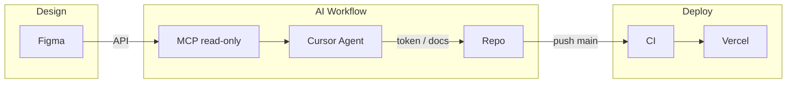

# Figma 設計稿至部署流程（AI-assisted Design-to-Code Pipeline）

**類型**：runbook | **權重**：2

本文件說明從 Figma 設計稿到前端專案維護再到上線部署的 **AI-assisted Design-to-Code Pipeline**，供展示或協作對齊用。Deployment 仍由 **repo → CI → Vercel** 主導，不將「改 Figma」納入 pipeline，保持穩定。**AI 修改邊界**（token / component / layout）見 [figma-mcp §4](../architecture/figma-mcp.md#四figma--ai-修改邊界治理三風險)。

---

## Pipeline 五階段

| 階段                 | 說明                                                                                              |
| -------------------- | ------------------------------------------------------------------------------------------------- |
| **Design Source**    | Figma（設計單一來源或與 DESIGN_SYSTEM.md 雙向對齊，見 [figma-mcp](../architecture/figma-mcp.md)） |
| **Token Extraction** | MCP（read-only）：透過 Figma MCP server 讀取檔案、variables、component spec                       |
| **Code Update**      | Cursor Agent：依 mapping 更新 token、docs；新增 component 須人工確認                              |
| **Validation**       | CI：`pnpm run build`、`pnpm run test`、`pnpm run lint:ci`（見 [local-dev](local-dev.md)）         |
| **Deployment**       | Vercel：main 分支 push 後自動建置並更新 production（見 [deployment](deployment.md)）              |

---

## 流程圖

---

## 使用前準備

1. **Token schema 與 mapping**：依 [figma-mcp](../architecture/figma-mcp.md) 導入順序，先定義 design token schema 與 figma → token mapping，再啟用 MCP。
2. **MCP 設定**：專案已包含 `tools/figma-mcp` 與 `.cursor/mcp.json`。請在 **Cursor → Settings → Tools & MCP** 中為 `figma` server 設定：
   - **FIGMA_ACCESS_TOKEN**（必填）：Figma 個人 access token。[Figma → Settings → Account → Personal access tokens](https://www.figma.com/developers/api#access-tokens)，scope 至少勾選 `file_content:read`；若要用 `get_variables` 再勾選 `file_variables:read`（部分組織需 Enterprise）。
   - **FIGMA_FILE_KEY**（選填）：預設要讀取的檔案 key。從 Figma 檔案 URL 取得：`https://www.figma.com/design/<FILE_KEY>/...` 或 `.../file/<FILE_KEY>/...` 中間的 `FILE_KEY`。不設則每次呼叫 tool 時需傳入 `file_key`。
   - 勿將真實 token 提交進 repo；可改在 Cursor 介面填寫 env。
3. **Agent 邊界**：以 repo 的 design system 與 token schema 為準，Figma 僅提供 context。AI 僅可修改既有 token 數值與 docs，不可新增 primitive token 或 UI component/variant；不依 Figma frame 改 layout。詳見 [figma-mcp §4](../architecture/figma-mcp.md#四figma--ai-修改邊界治理三風險)、[AGENT_CAPABILITIES.md](../../AGENT_CAPABILITIES.md)。

---

## 相關

- [figma-mcp](../architecture/figma-mcp.md)：MCP 架構、tools spec、Token transformation、Cursor config
- [design-system](../architecture/design-system.md)：半自動化 UI、Token canonical 在 repo
- [local-dev](local-dev.md)：CI 檢查、分支與 PR
- [deployment](deployment.md)：Vercel、Changesets
